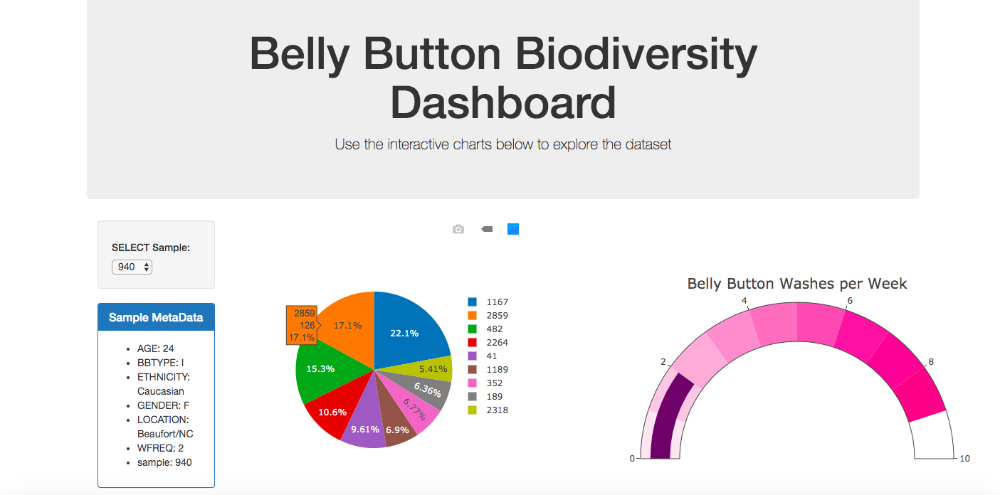
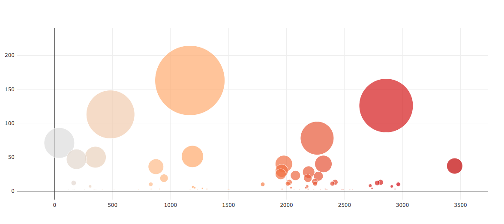

# plotly-challenge

Used Plotly.js to build interactive charts for the Belly Button Diversity dashboard.

1. Created a PIE chart that uses data from the samples route (/samples/<sample>) to display the top 10 samples.
  Used sample_values as the values for the PIE chart.
  Used otu_ids as the labels for the pie chart.
  Used otu_labels as the hovertext for the chart.
  
2. Created a Gauge chart that uses the metadata to display the washing frequency of each sample.

3. Displayed the sample metadata from the route /metadata/<sample>

4. Created a Bubble Chart that uses data from the samples route (/samples/<sample>) to display each sample.
  Used otu_ids for the x values.
  Used sample_values for the y values.
  Used sample_values for the marker size.
  Used otu_ids for the marker colors.
  Used otu_labels for the text values.

Heroku url:  https://sth-belly-button-diversity.herokuapp.com/
